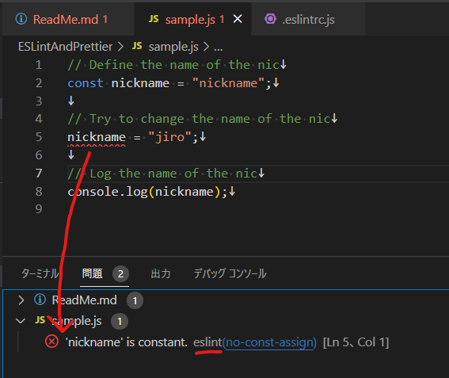
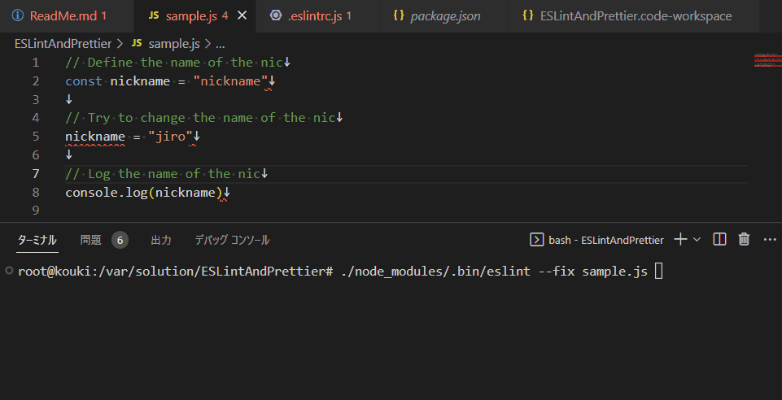
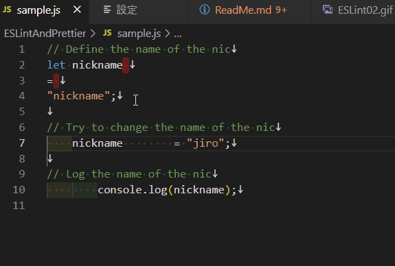
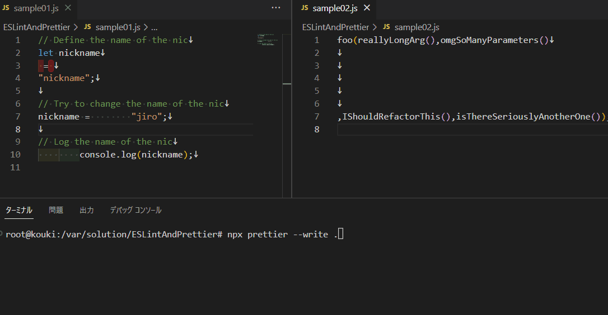

# ESLint と Prettier

---

## 作成の動機

- チーム開発で開発者による記述の差異が気になっていた。
- 技術記事で、開発では「ESLint と Prettier」は必須！と謳っているものが多い。
  - 効果を体感したかった。
- 設定方法が良く分かっていなかったので理解したかった。

---

## よくある問題

- 開発者によって微妙に書き方が違って読みづらい。
- ""と''が混在している。
- 末尾に;がない。
- 定数で指定した型が代入可能な型になっている。
- インデントの深さ間違えている。

---

## 紹介

- ESLint : 問題のあるコードを見つける（Linter）

  - https://eslint.org/

- Prettier : 不揃いなコードを揃える（formmater）
  - https://prettier.io/

---

## ESLint の効果

- 指摘箇所の洗い出し

  

---

## ESLint の効果

- 自動修正（末尾セミコロンを必須とした場合）
  ```bash
  ./node_modules/.bin/eslint --fix sample.js
  ```
  

---

## Prettier の効果

- 自動修正（VScode 設定による保存時）
  

---

## Prettier の効果

- 自動修正（node.js の実行時）
  ```bash
  npx prettier --write .
  ```
  

---

## 導入準備１

- 空のワークスペースにインストールする場合（Laravel プロジェクト内では不要）
  ```bash
  npm init
  ```
  - 出てくる選択肢はとりあえず全部設定なしで OK

---

## 導入準備２

- 保存時に機能するように設定する。
  - ファイル＞ユーザー設定＞設定＞「Editor: Format On Save」にチェックを入れる。
  - 設定の優先順位（右に行くほど優先）
  - 2 つの設定ファイル
    - ワークスペース名.code-workspace（推奨）
    - .vscode/settings.json
      - GitHub 上で開発の設定を共有できる。
      - 2 つあるとどっちが優先か分からなくなるので、使い分け必要。

---

## ESLint の導入

※両方とも導入する必要あります。

- [node.js](https://eslint.org/docs/latest/use/getting-started)

  - コードの指摘箇所を洗い出す
  - 設定にあわせて保存時に指摘箇所を自動修正します。
    - 設定ファイル：「.eslintrc.js」（json、または yaml 形式もあり）

- [VScode 拡張機能](https://marketplace.visualstudio.com/items?itemName=dbaeumer.vscode-eslint)
  - VScode のターミナル「問題」タブへ指摘を表示させる。

---

## Prettier の導入

※両方とも導入する必要ありそう？

- [node.js](https://prettier.io/docs/en/install.html)

  - コードの指摘箇所を洗い出す
  - 設定にあわせて保存時に指摘箇所を自動修正します。

- [VScode 拡張機能](https://prettier.io/docs/en/install.html)
  - VScode のターミナル「問題」タブへ指摘を表示させる。
  - 設定にあわせて保存時に指摘箇所を自動修正します。

---

## 応用

- PHP 用 plugin

  - https://github.com/prettier/plugin-php

- その他の Linter、formatter、チェック用拡張機能
  - スペルチェッカー：[Code Spell Checker](https://marketplace.visualstudio.com/items?itemName=streetsidesoftware.code-spell-checker)
  - 正しくない日本語チェック：[テキスト校正くん](https://marketplace.visualstudio.com/items?itemName=ICS.japanese-proofreading)

---

## 課題

- チーム間での設定共有

  - .code-woekspace を GitHub 上で共有

- どんな設定内容にするか

  - 最初は最低限、チームで議論しつつ徐々に追加していく。

- 導入タイミング
  - 過去プロジェクトは慎重に。
  - 新規のプロジェクトは冒頭から。

---

## まとめ

- 課題はあるが、ESLint と Prettier はコーディングの治安を良くしてくれそう。

  - コードの整理しやすくなる。
  - コードレビューしやすくなる。

- 正直設定はめんどくさいので、拡張機能と VScode の設定だけからはじめてもいいかも？

- とりあえず、「問題」タブはつぶしてからコードレビューだそう。

- やりすぎやコンクリフトには注意

---

以上
